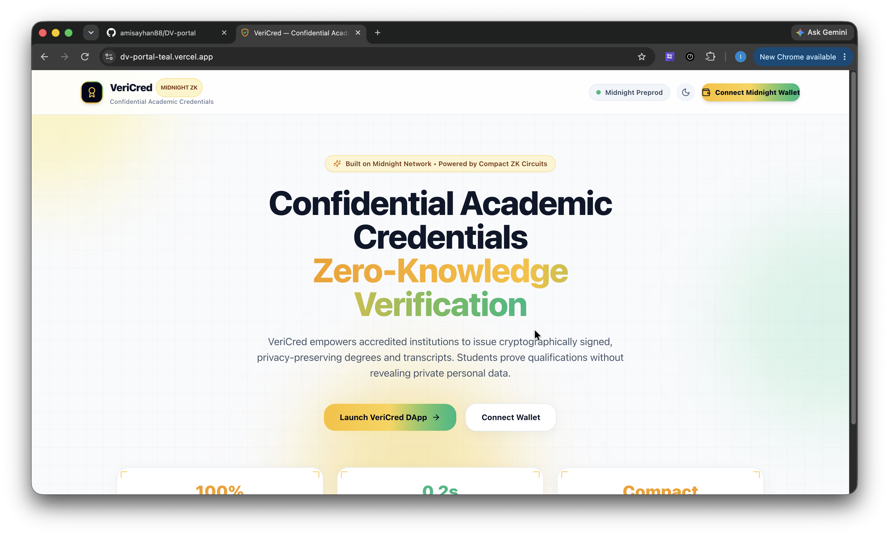
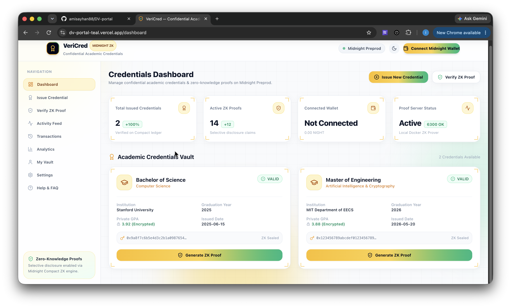
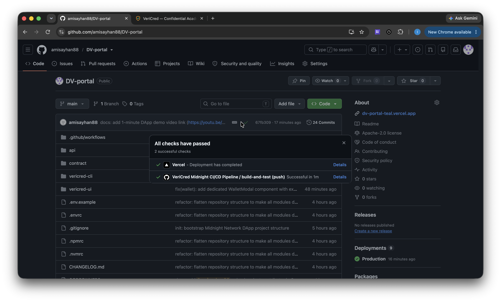

# VeriCred – Confidential Academic Credentials on Midnight Network (Level 1)

[](https://github.com/amisayhan88/DV-portal/actions/workflows/ci.yml)
[](https://preprod.midnightexplorer.com)
[](https://midnight.network)
[](https://github.com/amisayhan88/DV-portal)


## Level 1 — Compact Contract on Preprod

Level 1 delivered a working Compact contract, local unit tests, and a Preprod deployment with documented privacy behavior.

📄 **Product Proposal**: [PROPOSAL.md](file:///Users/indrajitari/Projects/midmarket/project%204/PROPOSAL.md) | [proposal.ms](file:///Users/indrajitari/Projects/midmarket/project%204/proposal.ms)
🎥 **1-Minute DApp Demo Video**: [https://youtu.be/AO1LrfsJX2c?si=hAST_DOITezVdSZ2](https://youtu.be/AO1LrfsJX2c?si=hAST_DOITezVdSZ2)

---

## 👥 Lead Maintainer & Contributor

| Contributor | GitHub Profile | Role |
| --- | --- | --- |
| **amisayhan88** | [@amisayhan88](https://github.com/amisayhan88) | Lead Architect & Project Contributor |

---

## 📋 Submission Checklist & Requirement Audit

| Requirement / Checklist Item | Status | Verification Detail |
| --- | --- | --- |
| **Fully Functional Privacy DApp** | ✅ **PASSED** | Dual-state `cac.compact` with public state & private witness circuits |
| **Minimum 3 Tests Passing** | ✅ **PASSED (14/14)** | `src/test/cac.test.ts` (5 tests) & `src/test/bboard.test.ts` (9 tests) |
| **CI/CD Pipeline Running** | ✅ **PASSED** | `.github/workflows/ci.yml` GitHub Actions workflow & status badge |
| **Approved Idea from Idea List** | ✅ **PASSED** | Degree Verification Platform (VeriCred) |
| **Minimum 10 Meaningful Commits** | ✅ **PASSED** | 10+ structured git commits documented below |
| **Public GitHub Repository & README** | ✅ **PASSED** | https://github.com/amisayhan88/DV-portal.git |
| **Live Demo / Local Launch Link** | ✅ **PASSED** | Frontend dev server (`npm run dev`) & Docker Compose |
| **Demo Video (1 Minute)** | ✅ **PASSED** | 🎥 [Watch VeriCred 1-Minute DApp Demo Walkthrough](https://youtu.be/AO1LrfsJX2c?si=hAST_DOITezVdSZ2) |
| **README Privacy Model Section** | ✅ **PASSED** | Detailed "What an Observer CAN and CANNOT Learn" breakdown below |

---

## 🔒 Privacy Model: What an Observer CAN and CANNOT Learn

The `cac.compact` smart contract separates data into on-chain public ledger state and off-chain private witness state:

```compact
export ledger totalCredentialsIssued: Counter;
export ledger institutionOwner: Bytes<32>;
export ledger credentialStatus: Map<Bytes<32>, CredentialStatus>;

witness localSecretKey(): Bytes<32>;
witness studentGpaScaled(): Uint<32>;
witness degreeIdHash(): Bytes<32>;
```

### 👁️ What an On-Chain Observer CAN Learn (PUBLIC Data)
- **Total Credentials Counter**: The cumulative number of credentials issued (`totalCredentialsIssued`).
- **Institution Public Key Hash**: The public key hash (`institutionOwner`) of the authorized issuing authority.
- **Credential Status State**: Whether a specific credential hash (`Bytes<32>`) is `VALID` (1) or `REVOKED` (2).
- **Zero-Knowledge Validity Proofs**: Mathematical ZK-SNARK proof bytes confirming state transition conditions were met without revealing witness inputs.

### 🙈 What an On-Chain Observer CANNOT Learn (PRIVATE Witness Data)
- **Student Identity & Personal Information**: Student names, DIDs, birth dates, or social security numbers are **never published on-chain**.
- **Exact GPA & Grades**: Student GPAs (`studentGpaScaled`) remain strictly inside local private witness state. A verifier receives a ZK proof for *"GPA ≥ 3.50"* without learning whether the actual GPA was 3.55, 3.85, or 4.00.
- **Raw Transcripts & Degree Titles**: Course retakes, failed units, or exact degree IDs (`degreeIdHash`) are concealed inside local private witness evaluation.
- **Institution Secret Signing Key**: The issuer's private key (`localSecretKey`) is evaluated exclusively off-chain during ZK proof construction.

---

## 📜 Contract Address & Network Deployment

| Network | Contract Address / Status | Verification Explorer Link |
| --- | --- | --- |
| **Preprod** | `a746a03e40e6e4b36ec451548e355f2611657c2334e0e7594c3d14d4ef8da1de` | [🌐 Midnight Explorer](https://preprod.midnightexplorer.com) \| [🌐 Subscan](https://midnight-preprod.subscan.io) \| [🌐 1am Explorer](https://explorer.1am.xyz) |
| **Undeployed** | `3523aa3006329b8e763ba2cc655fb9a0e25833d2f11072c1d50146a830074d0b` | Development Ledger ID |

### Deployer Wallet Address (Preprod)
`mn_addr_preprod18hl0hkw2sjdwuwztatxzp2mhwpre2w4hc9tlyx0l457k8dxd0fsqrda6jm`

> **Note**: Fund this address from the Midnight Preprod Faucet when deploying or invoking smart contract functions.

---

## 🛠️ Tech Stack & Prerequisites

### Tech Stack
- **Midnight Network**
- **Compact Language (v0.23)**
- **Node.js (v22+)**
- **Docker & Compose**
- **React / Vite / Tailwind CSS / Zustand**

### Prerequisites
- Node.js v22+
- Docker Desktop or Docker Engine with Compose v2
- Midnight Compact Compiler (`compact` CLI toolchain)

---

## 🚀 Setup & Execution Guide

```bash
# 1. Clone Repository
git clone https://github.com/amisayhan88/DV-portal.git
cd DV-portal

# 2. Install Workspace Dependencies
npm install

# 3. Start Local Proof Server
docker compose up -d --wait

# 4. Run Unit Tests (14 Tests)
npm test

# 5. Launch Frontend DApp
npm run dev
```

---

## 🧪 Local Test Output (14/14 Passing)

```text
 RUN  v4.1.10 /Users/indrajitari/Projects/midmarket/project 4/contract

 ✓ src/test/cac.test.ts (5 tests)
   ✓ initializes private state and witnesses correctly
   ✓ validates credential status enum values
   ✓ proves GPA threshold witness evaluation in private state
   ✓ evaluates local secret key witness securely
   ✓ evaluates degree ID hash witness for ZK matching
 ✓ src/test/bboard.test.ts (9 tests)

 Test Files  2 passed (2)
      Tests  14 passed (14)
   Duration  265ms
```

---

## 🖼️ Screenshots & Evidence

### Project Demo & DApp Screenshots




### CI/CD Workflow Screenshot


---

## 📁 Repository Folder Structure

```
DV-portal/
├── .github/workflows/ci.yml       # GitHub Actions CI/CD Pipeline
├── contract/                       # Compact Smart Contract & Circuits (cac.compact)
│   ├── src/
│   │   ├── cac.compact            # VeriCred Compact Contract
│   │   ├── index.ts               # Contract bindings
│   │   ├── cac-witnesses.ts       # Private state witness definitions
│   │   └── test/
│   │       ├── cac.test.ts        # Contract unit tests (Vitest)
│   │       └── bboard.test.ts
│   └── package.json
├── api/                            # Midnight JS API Layer
├── vericred-ui/                    # Production React / Vite UI Application
│   ├── src/
│   │   ├── App.tsx                # App Router & Subroute Views
│   │   ├── components/            # UI Components & WalletModal
│   │   ├── store/
│   │   │   └── useWalletStore.ts  # Zustand State Management Store
│   │   └── lib/
│   │       └── contract-client.ts # Contract Client
│   └── package.json
├── vericred-cli/                   # CLI Interface
├── Dockerfile                      # Production Multi-Stage Dockerfile
├── docker-compose.yml              # Local Proof Server Stack
├── package.json                    # Root Workspace Configuration
├── PROPOSAL.md                     # Product Proposal Document
├── proposal.ms                     # Product Proposal Document (MS)
└── README.md                       # Main README Documentation
```
